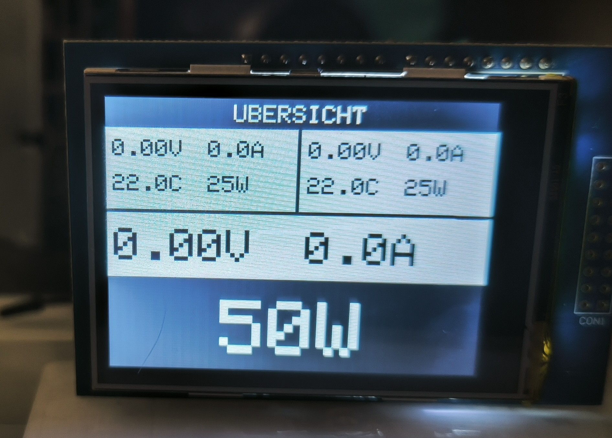

# Dual DPS 1200FB 24V PSU

## Overview
This project demonstrates how to use two HP DPS-1200FB server PSUs in series to create a 24V power supply. An Arduino Nano R4 and a custom PCB are used to monitor and control the PSUs, with a 2.8" Arduino Shield-based touchscreen TFT for user interaction and data display.

## Features
- Monitoring of PSU parameters: current, power draw, temperature and many more.
- Touchscreen user interface (2.8" Arduino-compatible display)
- Control of 12V output in case of failure (WIP)

## Folder Structure
- `circuit/` - KiCad project files for the custom PCB (WIP)
- `doc/` - Documentation, datasheets, and images
- `src/` - Arduino firmware source code

## Firmware
1. Open `src/PsuPowerMonitor/PsuPowerMonitor.ino` in the Arduino IDE.
2. Install required libraries
    - [MCUFRIEND_kbv](https://github.com/prenticedavid/MCUFRIEND_kbv)
    - [Adafruit GFX Library](https://github.com/adafruit/Adafruit-GFX-Library)
3. Select the correct board and port.
4. Upload the firmware to your microcontroller.

## Contributing
Contributions are welcome! Please open issues or submit pull requests for improvements, bug fixes, or new features.

# Special thanks to
- [DrTune/Raplin](https://github.com/raplin/DPS-1200FB)
- [slundell](https://github.com/slundell/dps_charger)
- [colindt](https://colintd.blogspot.com/2016/10/hacking-hp-common-slot-power-supplies.html)
- [neilp](https://www.rcgroups.com/forums/showpost.php?p=48212083&postcount=29)
- [Philipp Seidel](https://blog.seidel-philipp.de/hp-dps-1200fb-power-supply-hack-for-charging-lipos/)
